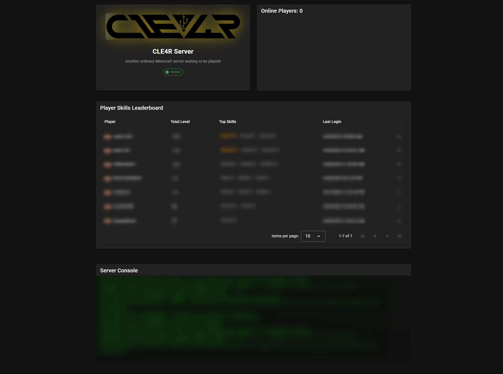

# 🎮 MineStatus - Real-Time Minecraft Server Dashboard

<div align="center">
  
  
  [](https://nodejs.org/)
  [](https://vuejs.org/)
  [](https://vuetifyjs.com/)
  [](https://socket.io/)
  [](LICENSE)
</div>

> **A beautiful, real-time web dashboard for monitoring your Minecraft server with style! ✨**

## 🌟 Features That Make It Shine

### 🔥 **Real-Time Everything**
- **Instant Player Updates** - See players join/leave as it happens using intelligent log file watching
- **Live Server Console** - Stream server logs directly to your browser with syntax highlighting
- **Dynamic Skills Leaderboard** - McMMO skills data that updates automatically with smart caching
- **Smooth Animations** - Elegant UI with pulsing effects, glowing elements, and sweeping light animations

### 🎨 **Modern & Beautiful UI**
- **Vuetify 3 Design System** - Material Design components with custom styling
- **Responsive Layout** - Perfect on desktop, tablet, and mobile
- **Dark/Light Theme Support** - Automatically adapts to user preferences
- **Minimalist Elegance** - Clean cards with subtle hover effects and smooth transitions

### ⚡ **Smart Backend Architecture**
- **RCON Integration** - Direct communication with your Minecraft server
- **Intelligent Caching** - Database-friendly with 60-second TTL to prevent flooding
- **Log File Monitoring** - Uses `chokidar` for efficient file watching without polling
- **Socket.IO Real-Time** - Bidirectional communication for instant updates

## 🚀 Quick Start

### Prerequisites
- Node.js 18+ 
- A running Minecraft server with RCON enabled
- McMMO plugin (for skills leaderboard)

### 🏗️ Installation

```bash
# Clone the repository
git clone https://github.com/JustCLE4R/minestatus.git
cd minestatus

# Install backend dependencies
cd backend
npm install

# Install frontend dependencies  
cd ../frontend
npm install
```

### ⚙️ Configuration

1. **Backend Setup**
```bash
cd backend
cp .env.example .env
```

Edit `.env` with your server details:
```env
# Database
DB_HOST=localhost
DB_USER=minecraft
DB_PASS=your_password
DB_NAME=minecraft_db

# RCON Configuration
RCON_HOST=localhost
RCON_PORT=25575
RCON_PASSWORD=your_rcon_password

# Log File Path
LOG_FILE=./logs/latest.log

# Server Port
PORT=3000
```

2. **Database Setup**
```bash
# Run migrations to create tables
npx sequelize-cli db:migrate

# (Optional) Seed with sample data
npx sequelize-cli db:seed:all
```

### 🎯 Running the Application

```bash
# Terminal 1: Start the backend
cd backend
npm start

# Terminal 2: Start the frontend
cd frontend  
npm run dev
```

Open your browser to `http://localhost:5173` and enjoy! 🎉

## 📱 Screenshots

<div align="center">
  
</div>

## 🏗️ Project Architecture

```
📦 minestatus/
├── 🖥️  backend/           # Node.js + Express + Socket.IO
│   ├── 🎮 services/       # RCON, Cache, Log services
│   ├── 🗄️  models/        # Sequelize database models  
│   ├── 🎯 controllers/    # Socket event handlers
│   └── 📝 logs/           # Server log files
│
├── 🎨 frontend/           # Vue 3 + Vuetify + Vite
│   ├── 🧩 components/     # Reusable Vue components
│   ├── 📄 pages/          # Application pages
│   ├── 🏪 stores/         # Pinia state management
│   └── 🎭 assets/         # Static assets
│
└── 📚 docs/               # Documentation & screenshots
```

## 🔧 Key Components

### Backend Services

- **🎮 RCON Service** - Direct server communication for player data
- **📊 Cache Service** - Intelligent caching with automatic emissions
- **📝 Log Service** - Real-time log file monitoring and streaming
- **🔌 Socket Controller** - WebSocket event management

### Frontend Components

- **🏠 ServerStatusCard** - Beautiful server info with animated logo
- **👥 OnlinePlayersCard** - Real-time player list with join/leave events  
- **📈 SkillsLeaderboardCard** - McMMO skills ranking with smooth updates
- **💬 ServerConsoleCard** - Live server console with syntax highlighting

## 🎨 Customization

### Adding New Skills
```javascript
// backend/models/skill.js
// Skills are automatically detected from your McMMO database
```

### Styling Components
```vue
<!-- Use Vuetify's design tokens -->
<v-card 
  color="primary"
  elevation="4"
  rounded="lg"
  class="my-custom-card"
>
```

### Custom Animations
```css
/* Add your own glowing effects */
.custom-glow {
  animation: gentle-glow 3s ease-in-out infinite;
}

@keyframes gentle-glow {
  0%, 100% { box-shadow: 0 0 5px rgba(0, 212, 255, 0.3); }
  50% { box-shadow: 0 0 20px rgba(0, 212, 255, 0.8); }
}
```

## 📊 Performance Features

- **⚡ Smart Caching** - Prevents database flooding with TTL-based refreshing
- **🔍 Efficient Log Watching** - Only processes new log entries, not entire files
- **📡 Selective Emissions** - Only broadcasts when data actually changes
- **🎯 Memory Management** - Automatic cleanup when no clients connected

## 🤝 Contributing

We love contributions! Here's how you can help:

1. 🍴 Fork the repository
2. 🌿 Create a feature branch (`git checkout -b feature/amazing-feature`)
3. 💾 Commit your changes (`git commit -m 'Add amazing feature'`)
4. 📤 Push to the branch (`git push origin feature/amazing-feature`)
5. 🎯 Open a Pull Request

### Development Guidelines
- Use conventional commits
- Add tests for new features
- Update documentation
- Follow existing code style

## 📄 License

This project is licensed under the MIT License - see the [LICENSE](LICENSE) file for details.

## 🙏 Acknowledgments

- **Minecraft** - For the amazing game we all love
- **McMMO** - For the skills system integration
- **Vue.js & Vuetify** - For the beautiful frontend framework
- **Socket.IO** - For real-time communication
- **The Community** - For feature requests and bug reports

## 📞 Support

Having issues? We're here to help!

- 🐛 [Report Bugs](https://github.com/JustCLE4R/minestatus/issues)
- 💡 [Request Features](https://github.com/JustCLE4R/minestatus/discussions)
- 📧 Email: support@minestatus.dev
- 💬 Discord: [Join our community](https://discord.gg/minestatus)

---

<div align="center">
  <p>Made with ❤️ for the Minecraft community</p>
  <p><strong>⭐ Star this repo if it helped you! ⭐</strong></p>
</div>